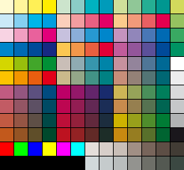

# ClassicComicColors
Classic Comic Colors for Photoshop

These are the 124 colors used in Classic Comics like old Marvel, DC, Disney etc ... as an .aco-file for use in photoshop. The colors look great in print comics because they only use the C, M and Y channel of CMYK, so they don't clash with the black outlines. I added some warm and some cold greys, also without the K channel.

For more info on this topic I recommend the fantastic book "The DC Comics Guide to Coloring and Lettering Comics" by Mark Chiarello and Todd Klein.

